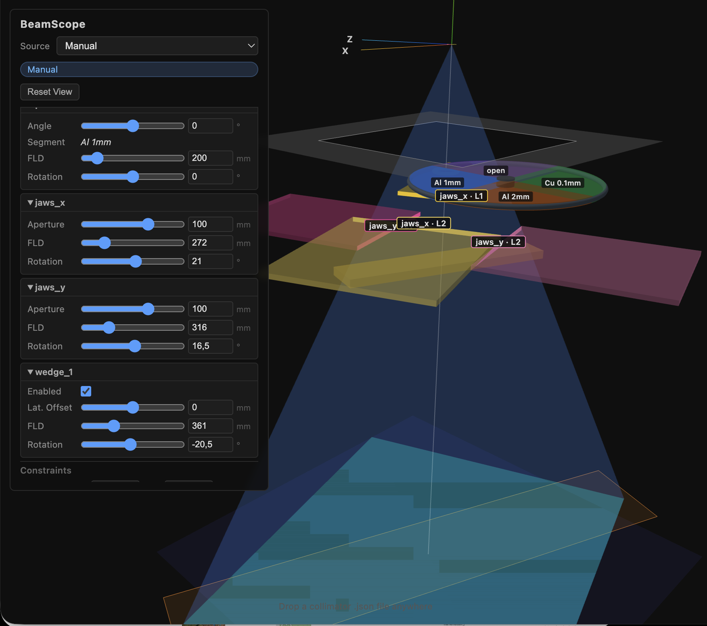
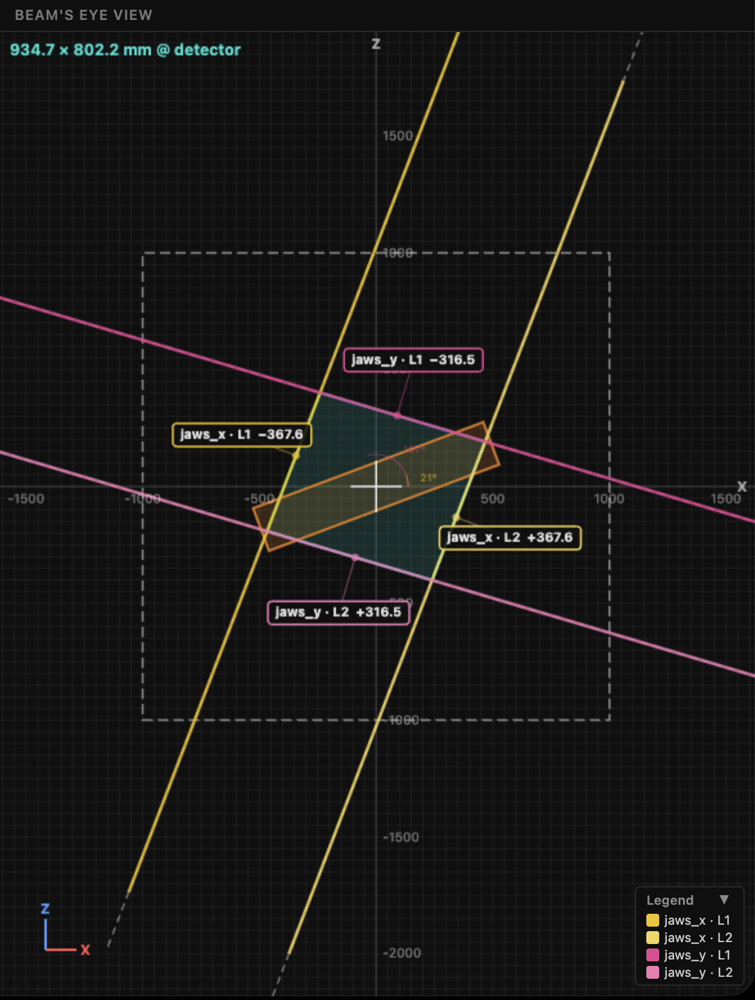
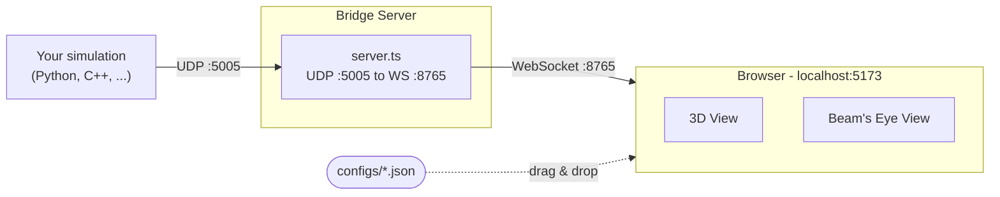

# BeamScope

> Real-time 3D visualization of X-ray collimator beam fields for radiography and angiography systems — driven by live simulation data, configurable via JSON, runs entirely in the browser.


---

BeamScope receives real-time collimator state from a simulation process via UDP, forwards it to the browser through a local WebSocket bridge, and renders the geometry in two synchronized views: an interactive 3D perspective scene and a 2D Beam's Eye View (BEV) projection.

The collimator is described as a JSON configuration file — any combination of jaw modules, wedge filters, rotating pre-filter wheels, and a primary collimator can be assembled without touching code.

---

## Screenshots

| 3D Perspective View | Beam's Eye View (BEV) |
|---|---|
|  |  |

---

## Features

- **Two synchronized views** — interactive rotatable 3D scene + 2D top-down BEV projection
- **Modular collimator model** — assemble any combination of modules via a single JSON file
- **5 module types**: symmetric rectangular jaws, 4-jaw square collimator, asymmetric jaws, physical wedge filter, rotating pre-filter wheel
- **Geometrically correct** — all leaf positions are specified at the leaf plane (FLD); the visualizer handles projection to detector coordinates, edge-jump at the central axis, and primary collimator clipping
- **Per-leaf color coding** — every leaf has a distinct color across the 3D scene, BEV, and UI controls
- **Imaging edge highlighting** — active imaging face visually distinct from the non-imaging face; edge jump handled correctly when a leaf crosses the central axis
- **Rotating pre-filter wheel** — pie-slice segments with per-segment labels that spin with the disk; active segment highlighted by opacity
- **Mechanical constraint detection** — end-stop violations and leaf crossing highlighted in real time (red + UI badge)
- **Three switchable data sources** — live simulation (UDP), manual UI, *(replay mode planned)*
- **Flexible config loading** — specify startup config via `?config=` URL parameter, or swap configs at runtime via drag and drop
- **No client install required** — runs in any modern browser

---

## Architecture



The bridge and the visualizer are fully decoupled. Any process that can send UDP datagrams can drive the visualizer — no SDK or library required.

---

## Getting Started

### Prerequisites

- [Bun](https://bun.sh) ≥ 1.0 (recommended), or Node.js ≥ 20 for the bridge
- Python 3 (standard library only — for the demo simulation)
- A modern browser (Chrome or Firefox)

### Install dependencies

```bash
cd bridge && bun install
cd visualizer && bun install
```

### Start

```bash
# Terminal 1 — bridge server (UDP → WebSocket)
cd bridge && bun run start

# Terminal 2 — visualizer (dev mode with hot reload)
cd visualizer && bun run dev
```

Open **http://localhost:5173** in your browser.

### Load a collimator configuration

**Option 1 — URL parameter (startup):**

Pass the config filename as a query parameter to load it directly on start:

```
http://localhost:5173?config=quad-jaw-v1.json
http://localhost:5173?config=/configs/quad-jaw-v1.json
```

Bare filenames are resolved relative to `/configs/`. Without the parameter, `example-collimator.json` is loaded.

**Option 2 — Drag and drop (runtime):**

Drag any `.json` config file onto the browser window to swap configs without restarting:

- `configs/example-collimator.json` — pre-filter + rectangular jaw pairs (X/Y) + wedge
- `configs/quad-jaw-v1.json` — 6-segment pre-filter + 4-jaw square + two wedge filters + circular primary collimator

### Switch to Simulation mode

Click the **data source dropdown** in the top bar and select **Simulation**. The bridge must be running and receiving UDP data.

---

## Demo Simulation

A config-driven demo is included — reads the collimator JSON and auto-generates matching animation for all modules. No external dependencies needed (Python 3 stdlib only).

```bash
# Default config (example-collimator.json)
python3 scripts/demo_simulation.py

# Quad-jaw config
python3 scripts/demo_simulation.py --config configs/quad-jaw-v1.json
```

Each axis uses a sinusoidal base motion with a band-limited random walk, giving continuous, non-repetitive movement at 30 Hz. Module IDs, FLD values, and constraint ranges are read directly from the config so they always stay in sync.

**Start order:**
1. `cd bridge && bun run start`
2. `cd visualizer && bun run dev` → open browser
3. `python3 scripts/demo_simulation.py --config configs/example-collimator.json`
4. Switch browser dropdown to **Simulation**

The visualizer loads the matching config automatically when you use the `?config=` URL parameter:
```
http://localhost:5173?config=quad-jaw-v1.json
```

**CLI options:**

```
--config  configs/example-collimator.json   Collimator config JSON
--host    127.0.0.1                         Bridge UDP host (default: 127.0.0.1)
--port    5005                              Bridge UDP port (default: 5005)
--rate    30                                Update rate in Hz (default: 30)
```

**What the demo animates (per module type):**

| Module type | Animation |
|---|---|
| `jaws_rect` / `jaws_square` / `jaws_asymmetric` | Symmetric aperture oscillation within constraint range |
| `prefilter` | Continuous rotation (sinusoidal, ~20 s period) |
| `wedge` | Lateral offset oscillation (always enabled) |
| *global* | SID variation around 1000 mm, collimator rotation drift ±15° |

### Single test packet (no Python)

```bash
node scripts/send-test-udp.js
```

Sends one static snapshot packet for quick connectivity testing.

---

## Collimator Configuration Reference

Collimators are defined as JSON files. Modules are listed in physical order from radiation source to detector.

### Top-level structure

```json
{
  "collimator_id": "my-collimator-v1",
  "description": "Optional human-readable description",
  "primary_collimator": { ... },
  "modules": [ ... ]
}
```

### Primary collimator

The hard aperture closest to the source. Dimensions are specified **at the primary aperture plane** (`fld_mm` from the source), not at the detector.

```json
{
  "shape": "rect",
  "size": { "x": 300.0, "y": 300.0 },
  "fld_mm": 150.0
}
```

For a circular primary collimator:

```json
{
  "shape": "circle",
  "radius_mm": 130.0,
  "size": { "x": 260.0, "y": 260.0 },
  "fld_mm": 140.0
}
```

| Field | Type | Description |
|---|---|---|
| `shape` | `"rect"` \| `"circle"` \| `"ellipse"` | Aperture shape |
| `size` | `{ x, y }` | Aperture dimensions in mm at `fld_mm` |
| `radius_mm` | number | Radius in mm — for `"circle"` / `"ellipse"` |
| `fld_mm` | number | Focus-to-aperture distance in mm |

### Common module fields

| Field | Type | Required | Description |
|---|---|---|---|
| `id` | string | yes | Unique module ID — **must match the keys in the data stream** |
| `type` | string | yes | Module type — see below |
| `fld_mm` | number | yes | Focus-to-leaf distance in mm (default; may be overridden per frame in the data stream) |
| `thickness_mm` | number | yes | Physical leaf thickness in mm |
| `rotation_deg` | number | no | Static module rotation in degrees; additive with global `collimator_rotation_deg` |
| `constraints` | object | no | `{ "min_mm": -150, "max_mm": 150 }` — mechanical end-stop limits |

### Module types

#### `jaws_rect` — Symmetric rectangular jaw pair

Leaf1 and leaf2 move symmetrically: one slider controls both (aperture half-width).

```json
{
  "id": "jaws_x",
  "type": "jaws_rect",
  "fld_mm": 500.0,
  "thickness_mm": 80.0,
  "rotation_deg": 0.0,
  "constraints": { "min_mm": -150.0, "max_mm": 150.0 }
}
```

#### `jaws_square` — 4-jaw square collimator

Two orthogonal jaw pairs sharing the same aperture constraints. Pair 2 is physically rotated 90° relative to pair 1. Both pairs close symmetrically.

```json
{
  "id": "jaws_sq",
  "type": "jaws_square",
  "fld_mm": 460.0,
  "thickness_mm": 80.0,
  "rotation_deg": 0.0,
  "constraints": { "min_mm": -120.0, "max_mm": 120.0 }
}
```

#### `jaws_asymmetric` — Asymmetric jaw pair

Leaf1 and leaf2 move independently, each with their own slider.

```json
{
  "id": "jaws_asym",
  "type": "jaws_asymmetric",
  "fld_mm": 500.0,
  "thickness_mm": 80.0,
  "constraints": { "min_mm": -150.0, "max_mm": 150.0 }
}
```

#### `wedge` — Physical wedge filter

A cuboid wedge that can be moved laterally and toggled in/out of the beam.

```json
{
  "id": "wedge_1",
  "type": "wedge",
  "fld_mm": 600.0,
  "thickness_mm": 15.0,
  "enabled": true,
  "lateral_offset_mm": 0.0
}
```

| Extra field | Type | Description |
|---|---|---|
| `enabled` | boolean | Whether the wedge is in the beam (startup default) |
| `lateral_offset_mm` | number | Lateral position of the wedge (startup default) |

#### `prefilter` — Rotating filter wheel

A spinning disk with pie-slice filter segments. The currently active segment (the one the beam passes through) is highlighted by increased opacity.

```json
{
  "id": "prefilter",
  "type": "prefilter",
  "fld_mm": 200.0,
  "thickness_mm": 10.0,
  "segments": [
    { "from_deg": 0,   "to_deg": 90,  "filter_value": "Al 1mm"   },
    { "from_deg": 90,  "to_deg": 180, "filter_value": "Al 2mm"   },
    { "from_deg": 180, "to_deg": 270, "filter_value": "Cu 0.1mm" },
    { "from_deg": 270, "to_deg": 360, "filter_value": "open"     }
  ]
}
```

| Extra field | Type | Description |
|---|---|---|
| `segments` | array | List of filter segments |
| `segments[i].from_deg` | number | Start angle of this segment (0–360) |
| `segments[i].to_deg` | number | End angle (wrap-around supported: `from_deg > to_deg`) |
| `segments[i].filter_value` | string | Human-readable filter label (e.g. `"Al 2mm"`, `"open"`) |

### Complete example — `configs/example-collimator.json`

```json
{
  "collimator_id": "example-collimator-v1",
  "description": "Example: pre-filter, two rectangular jaw pairs (X/Y), and a wedge filter",
  "primary_collimator": {
    "shape": "rect",
    "size": { "x": 300.0, "y": 300.0 },
    "fld_mm": 150.0
  },
  "modules": [
    {
      "id": "prefilter",
      "type": "prefilter",
      "fld_mm": 200.0,
      "thickness_mm": 10.0,
      "segments": [
        { "from_deg": 0,   "to_deg": 90,  "filter_value": "Al 1mm"   },
        { "from_deg": 90,  "to_deg": 180, "filter_value": "Al 2mm"   },
        { "from_deg": 180, "to_deg": 270, "filter_value": "Cu 0.1mm" },
        { "from_deg": 270, "to_deg": 360, "filter_value": "open"     }
      ]
    },
    {
      "id": "jaws_x",
      "type": "jaws_rect",
      "fld_mm": 500.0,
      "thickness_mm": 80.0,
      "rotation_deg": 0.0,
      "constraints": { "min_mm": -150.0, "max_mm": 150.0 }
    },
    {
      "id": "jaws_y",
      "type": "jaws_rect",
      "fld_mm": 520.0,
      "thickness_mm": 80.0,
      "rotation_deg": 90.0,
      "constraints": { "min_mm": -150.0, "max_mm": 150.0 }
    },
    {
      "id": "wedge_1",
      "type": "wedge",
      "fld_mm": 600.0,
      "thickness_mm": 15.0,
      "enabled": true,
      "lateral_offset_mm": 0.0
    }
  ]
}
```

### Alternative example — `configs/quad-jaw-v1.json`

A more complex configuration with a 6-segment pre-filter, a 4-jaw square collimator (circular primary aperture), and two independently rotatable wedge filters.

---

## Data Stream Protocol

This section documents the exact UDP packet format so you can integrate BeamScope with your own simulation.

### Transport

| Parameter | Default | Environment variable |
|---|---|---|
| UDP port (bridge listens) | `5005` | `UDP_PORT` |
| WebSocket port (browser connects) | `8765` | `WS_PORT` |

Send raw JSON encoded as **UTF-8** via UDP to the bridge:

```bash
UDP_PORT=5005 WS_PORT=8765 bun run start   # custom ports
```

The bridge validates the JSON and forwards it to all connected WebSocket clients. Multiple browser tabs can connect simultaneously.

### Packet format

```json
{
  "timestamp": 1234567890123,
  "sid": 1000.0,
  "collimator_rotation_deg": 0.0,
  "focal_spot": { "x": 1.2, "y": 1.2 },
  "modules": {
    "jaws_x": {
      "leaf1": -100.0,
      "leaf2": 100.0,
      "rotation_deg": 0.0,
      "fld_mm": 500.0
    },
    "jaws_y": {
      "leaf1": -80.0,
      "leaf2": 80.0,
      "rotation_deg": 0.0
    },
    "prefilter": {
      "angle_deg": 135.0,
      "rotation_deg": 0.0
    },
    "wedge_1": {
      "enabled": true,
      "lateral_offset_mm": 25.0,
      "rotation_deg": 0.0
    }
  }
}
```

### Top-level fields

| Field | Type | Description |
|---|---|---|
| `timestamp` | integer | Unix timestamp in ms — informational only |
| `sid` | number | Source-to-image distance in mm |
| `collimator_rotation_deg` | number | Global rotation applied additively on top of every module's `rotation_deg` |
| `focal_spot` | object | `{ x, y }` — focal spot dimensions in mm (display only) |
| `modules` | object | Map of module ID → module state |

### Per-module fields

**Jaw modules** (`jaws_rect`, `jaws_square`, `jaws_asymmetric`):

| Field | Type | Description |
|---|---|---|
| `leaf1` | number | Imaging edge position of leaf 1 at the leaf plane in mm |
| `leaf2` | number | Imaging edge position of leaf 2 at the leaf plane in mm |
| `rotation_deg` | number | Module rotation in degrees |
| `fld_mm` | number | *(optional)* Override the config `fld_mm` for this frame |

**Pre-filter wheel** (`prefilter`):

| Field | Type | Description |
|---|---|---|
| `angle_deg` | number | Current wheel rotation angle in degrees |
| `rotation_deg` | number | Module rotation offset in degrees |

**Wedge filter** (`wedge`):

| Field | Type | Description |
|---|---|---|
| `enabled` | boolean | `true` = wedge is in the beam path |
| `lateral_offset_mm` | number | Lateral position of the wedge in mm |
| `rotation_deg` | number | Module rotation in degrees |

### Partial updates

You do not need to include all modules in every packet. The visualizer **deep-merges** incoming state, so you can send only the fields that changed:

```json
{
  "sid": 1000.0,
  "collimator_rotation_deg": 5.3,
  "modules": {
    "jaws_x": { "leaf1": -55.0, "leaf2": 55.0 }
  }
}
```

### Geometry notes for integrators

- **Leaf values = imaging edge position at the leaf plane (FLD)** — not at the detector. At `leaf = 0`, the imaging edge is exactly at the beam axis.
- **Projection** is handled entirely by the visualizer: `pos_detector = pos_leaf × (SID / fld_mm)`
- **Edge jump** when a leaf crosses the central axis (leaf1 goes positive or leaf2 goes negative) is computed and visualized correctly.
- **Rotation convention**: `rotation_deg` per module is additive with `collimator_rotation_deg`. Final orientation = `config.rotation_deg + modState.rotation_deg + collimator_rotation_deg`.
- **Coordinate system**: Y = beam axis (radiation source at Y = 0, detector at Y = −SID), X and Z = lateral axes.

---

## Tech Stack

| Layer | Technology |
|---|---|
| 3D rendering | [Three.js](https://threejs.org) 0.172 |
| Frontend | TypeScript 5.7 + [Vite](https://vitejs.dev) 6 |
| Bridge server | [Bun](https://bun.sh) / Node.js + [ws](https://github.com/websockets/ws) |
| Transport | UDP → WebSocket (plain JSON) |
| Demo simulation | Python 3 (standard library only) |

---

## Project Status

Early development — hobby project.

**Implemented:**
- UDP → WebSocket bridge with reconnection
- 3D visualization: beam cone, focal spot, jaw leaves with per-leaf color coding, wedge filter, rotating pre-filter wheel, primary collimator clipping
- 2D Beam's Eye View with per-leaf edge annotations, field dimensions, and distance measurements
- Geometrically correct FLD projection, edge jump, and primary collimator intersection
- Mechanical constraint detection (end-stop + leaf crossing) with real-time highlight
- Schema-driven manual control UI (auto-generated from config, no hardcoding)
- Three switchable data sources (simulation / manual)
- Drag-and-drop config loading

**Planned / not yet implemented:**
- Replay mode (load and step through recorded sessions)
- C-arm / tube geometry (rotation of the entire imaging system)
- DICOM export
